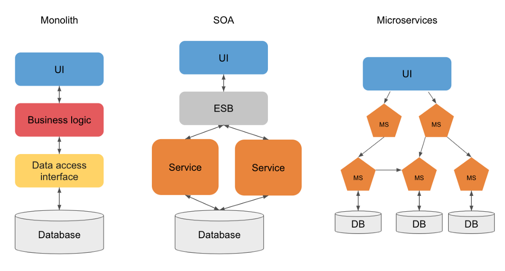

# 📗 Introdução

_**Microservices**_ é uma maneira particular de desenvolver aplicações de maneira que cada módulo do software **é um serviço standalone cujo deploy e escala acontecem de maneira independentes** da “aplicação principal”. Enquanto na arquitetura tradicional de software, chamada monolítica, quebramos uma grande aplicação em bibliotecas, cujos objetos são utilizados in-process, em uma aplicação modular como proposta na arquitetura de _**microservices**_ cada módulo recebe requisições, as processa e devolve ao seu requerente o resultado, geralmente via HTTP.

A ideia não é exatamente nova, é usada em ambientes Unix desde a década de 60, mas recentemente se tornou o epicentro de uma grande revolução na forma como as empresas estão desenvolvendo **software ágil** baseado em equipes enxutas responsáveis por componentes auto-suficientes.

## **Como funciona a arquitetura monolítica ?**

As principais linguagens de desenvolvimento de aplicações oferecem abstrações para quebrar a complexidade dos sistemas em módulos. Entretanto, são projetadas para a criação de um único executável **monolítico**, no qual **toda a modularização utilizada é executada em uma mesma máquina**. Assim, **os módulos compartilham recursos de processamento, memória, bancos de dados e arquivos**.&#x20;

Uma arquitetura monolítica típica de um sistema complexo pode ser representada pela figura abaixo, na qual todas as funções do negócio estão implementadas em um único processo.&#x20;

Ao longo do tempo o sistema vai crescendo, se tornando mais complexo e consumindo cada vez mais recursos, o que acaba gerando também alguns **desafios** substanciais para a manutenção desse tipo de arquitetura. O sistema se torna tão **complexo** que a manutenção fica cada vez mais cara e lenta, porque os desenvolvedores têm que navegar em uma **infinidade** de códigos. Muitas funções são **interdependentes** e **entrelaçadas**, de forma que a inclusão ou manutenção de componentes do sistema pode causar **inconsistências** ou comportamentos **inesperados**. Mesmo que apenas parte da funcionalidade seja necessária na nova instância, uma arquitetura monolítica exige que **todo o sistema seja replicado**, o que gera custos maiores do que o esperado.  Exige que os desenvolvedores fiquem **amarrados** à tecnologia originalmente escolhida para o sistema, mesmo que em algumas situações ela não seja a melhor escolha. Qualquer mudança, por menor que seja, requer a **reinicialização do sistema**. Como isso pode causar algum risco operacional, é necessário que as equipes de desenvolvimento, testes e manutenção desses sistema acompanhem essas alterações. &#x20;

## O que é uma arquitetura de microservices ? 


_The term “Microservice Architecture” has sprung up over the last few years to describe a particular way of designing software applications as suites of independently deployable services. While there is no precise definition of this architectural style, there are certain common characteristics around organization around business capability, automated deployment, intelligence in the endpoints, and decentralized control of languages and data. — **Martin Fowler**_


Segundo o _**Martin Fowler, ele cita que o termo de** “Arquitetura de **microservices**” surgiu nos últimos anos para descrever uma maneira particular de projetar aplicativos de software como conjuntos de serviços implantáveis ​​independentemente._

Então uma arquitetura de _**microservices**_ adota essa mesma abordagem e a estende aos serviços fracamente acoplados que podem ser desenvolvidos, implantados e mantidos de forma _**independente**_. Cada um desses serviços é _**responsável**_ por tarefas _**distintas**_ e pode se comunicar com outros serviços por meio de _**APIs**_ simples para resolver um problema de negócios complexo maior.

### _Monolítica x SOA x Microservice_

O que diferencia a arquitetura de _**microservices**_ das abordagens monolíticas mais tradicionais é como ela decompõe a aplicação por funções básicas. **Cada função é denominada um serviço e pode ser criada e implantada de maneira independente. Isso significa que cada serviço individual pode funcionar ou falhar sem comprometer os demais.**

Nos primórdios do desenvolvimento de aplicações, até mesmo as alterações mais insignificantes em uma aplicação pronta exigiam uma atualização da versão de atacado, com um ciclo próprio de garantia da qualidade (QA). Isso provavelmente atrasava o trabalho de muitas subequipes. Muitas vezes, essa abordagem é chamada de "monolítica" porque o código-fonte da aplicação toda era incorporado em uma única unidade de implantação, como .war ou .ear. Se a atualização de alguma das partes causasse erros, era necessário desativar a aplicação inteira, reverter a escala e corrigir o problema. **Embora essa abordagem ainda seja viável para aplicações menores, as empresas em ampla expansão não podem se dar ao luxo de sofrer com downtime.** A arquitetura orientada a serviço serve pra resolver essa questão, pois estrutura as aplicações em serviços distintos e reutilizáveis que se comunicam por meio de um Enterprise Service Bus (ESB).

Muitos dizem que o _**microservices**_ é o uma evolução do SOA (Service-oriented architecture) que traduzido significa arquitetura orientada a serviços, isso é quase verdade pois ambos são orientados a serviços que se comunicam entre si, essa paridade torna-se incoerente quando afirmado que o _**microservices**_  são “SOA bem executado”, tendo em vista que aplicações monolíticas são desenvolvidas em modelos SOA com características ESB (Enterprise Service Bus).

A definição de _**microservices**_ pode lembrar outro tipo de arquitetura bastante semelhante, a Arquitetura Orientada a Serviços (SOA), um projeto de software já bem definido. Levando em consideração a história da SOA, os _**microservices**_ não são uma ideia completamente nova. Porém, eles se tornaram mais viáveis graças aos avanços nas tecnologias de **conteinerização**. Com os containers Linux, agora é possível executar várias partes de uma aplicação de maneira independente no mesmo hardware e com um controle muito maior sobre os componentes individuais e ciclos de vida. Com as APIs e as equipes de DevOps, os _**microservices**_ em **containers** são os pilares das aplicações nativas em nuvem.

Os _**microservices**_ podem se comunicar entre si, normalmente de maneira **stateless**. Portanto, as aplicações criadas dessa maneira podem ser mais tolerantes a falhas e depender menos de um único ESB. Além disso, as equipes de desenvolvimento podem escolher as ferramentas que desejarem, pois os _**microservices**_ podem se comunicar por meio de interfaces de **programação de aplicações (APIs)** independentes de linguagem.

### API Gateway x Microservices

A **API** é o acrônimo de Application Programming Interface, em uma tradução direta para o português interface de programação de aplicação, esse conceito nada mais é do que uma maneira de comunicação entre serviços que facilita a integração entre sistemas já existente sem a necessidade de conhecer detalhes da outra ponta, sua aplicação prática é o compartilhamento de informação “dados” entre _**microservices**_ . Para ocorrer essa comunicação faz necessário as requisições HTTP (Hypertext Transfer Protocol) que fornece alguns verbos necessários para utilização desses dados, API Restful enquadra como base da tecnologia REST (representational state transfer) para atender requisições como:&#x20;

**POST**: Enviar dados para o servidor.&#x20;

**GET**: Realizar leitura de dados.&#x20;

**PUT**: Sobrescrever dados já enviados.&#x20;

**DELETE**: Excluir informação. Também existe outros mas pouco utilizado como:&#x20;

**HEAD**: Obter informações por meio do cabeçalho da resposta.&#x20;

**TRACE**: Realiza um teste de loopback para debug.&#x20;

**OPTIONS**: Permite descobrir quais requisições estão permitida no servido.&#x20;

**CONNECT**: Favorece o uso de proxy. Existem três distinção de acesso das APIs definidos da seguinte forma:&#x20;

* Privada: Utilizado localmente para comunicar com aplicações legadas ou para ser consumidas entre serviços.&#x20;
* Parceiro: São utilizadas entre parceiros de negócios B2B para permitir o compartilhamento de dados, facilitando na integração entre sistemas distintos.
* Pública: É disponível livremente para que os desenvolvedores façam uso em suas aplicações, muitas vezes sem restrições

#### Qual a função da API Gateway no _M**icroservices**_ ?

Devido a **complexidade** do redirecionamento do tráfego faz sentido estabelecer um ponto comum de entrada, facilitando o roteamento, a monitoração e politica de acesso.

**Protocolo síncrono**: Quando é enviado uma requisição, o processo remetente aguarda o retorna da resposta, sendo assim, não é possível enviar novas requisições, esse modelo foi visto como REST.&#x20;

**Protocolo assíncrono**: Não existe sincronismo entre as requisições, sendo assim, podemos enviar diversas requisições em paralelo esse modelo permite que seja utilizado ferramentas como RabbitMQ e Kafka.&#x20;

Para fechar o assunto **Microservices **_****_ é resumidamente o modelo de arquitetura de software, sendo que cada módulo do sistema é um serviço autossuficiente “stand-alone”. API por sua vez normalmente é o meio pelo qual os micros-serviços se comunicam na camada do software.
